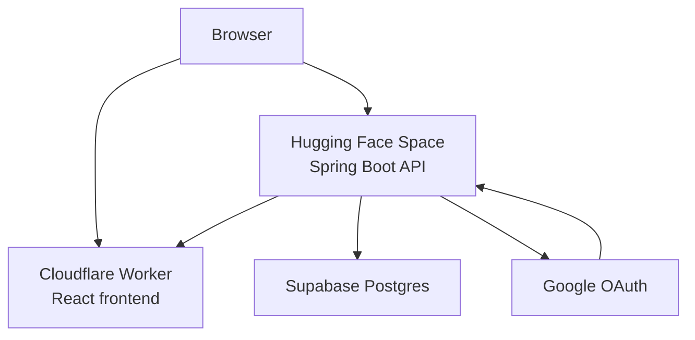

# Slate

Slate is a whiteboard MVP: sign in, create boards, draw with Excalidraw, autosave, and reopen boards later.

## Apps

- `apps/web` - React, Vite, TypeScript, Tailwind, Zustand, Excalidraw
- `apps/api` - Spring Boot 3, Java 21, Spring Security OAuth2, Spring Data JPA
- `docker` - local PostgreSQL compose setup

## Local Development

Start PostgreSQL:

```bash
docker compose -f docker/docker-compose.yml up -d
```

Run the API:

```bash
cd apps/api
mvn spring-boot:run
```

Run the web app:

```bash
cd apps/web
pnpm install
pnpm dev
```

The frontend expects the API at `http://localhost:8080`.

For deployed frontend builds, set:

```bash
VITE_API_BASE_URL=https://astro-v1-slate.hf.space
```

For local development, `SLATE_DEV_USER_ENABLED=true` lets API requests use a built-in dev user. To enable Google OAuth, set `GOOGLE_CLIENT_ID` and `GOOGLE_CLIENT_SECRET`, then start the API with the `oauth` profile:

```bash
mvn spring-boot:run -Dspring-boot.run.profiles=oauth
```

## Deployment

Current low-cost deployment shape:



Production backend environment:

```bash
SPRING_PROFILES_ACTIVE=oauth
SLATE_WEB_ORIGIN=https://slate.sakethpavan21.workers.dev
SLATE_DEV_USER_ENABLED=false
DATABASE_URL=jdbc:postgresql://...
GOOGLE_CLIENT_ID=...
GOOGLE_CLIENT_SECRET=...
```

Google OAuth should use:

```text
Authorized JavaScript origin:
https://slate.sakethpavan21.workers.dev

Authorized redirect URI:
https://astro-v1-slate.hf.space/login/oauth2/code/google
```
